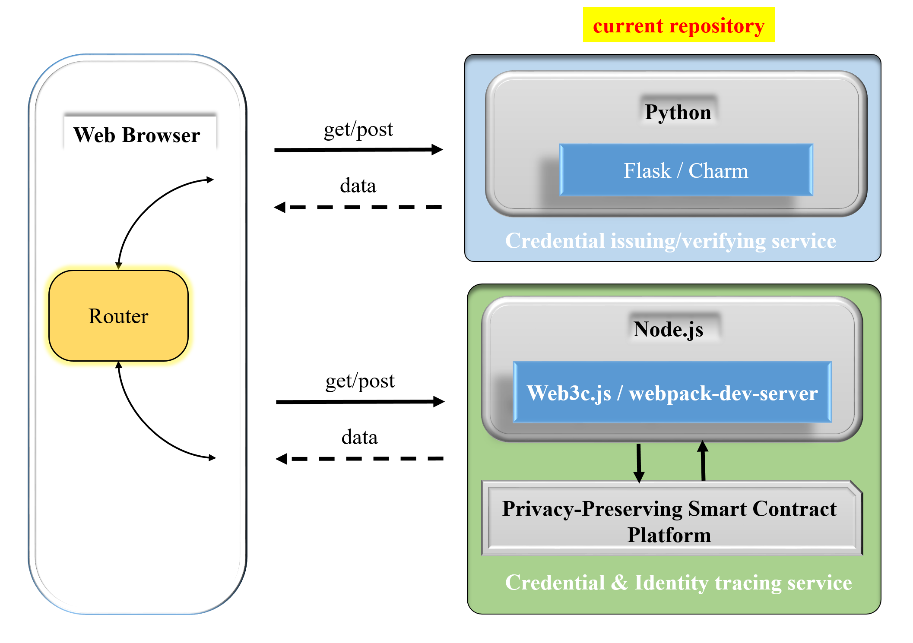

# Auditable-blindCA-issuer


As shown in the following picture, Auditable-blindCA-issuer is a single application as a suite of the whole system. It is responsible for blindly issuing and verifying certificates. There is no interaction with blockchain in this application. 

<div align="center">
 
</div>

We refer the interested readers to [auditable-blindCA-core](https://github.com/blockchain-crypto-lab/auditable-blindCA-core) to understand the whole system architecture.

## Quick start using Docker

### Get the image

1. First ensure you have Docker installed. [See Docker installation help](https://docs.docker.com/install/).

2. From a command line below, build your Docker container:
    
    ```
    docker pull awathcsea/blindca.
    ```

    This image will expose 8081 inside the container and receive web requests, passing different requests to issuing service.

### Run the Docker

   
    docker run -t -i -p 8080:8080 aowatchsea/blindca.
   

### Start the services
 
   ```
   > cd auditable-blindCA-demo/src
   > python start_app.py  
   ```
